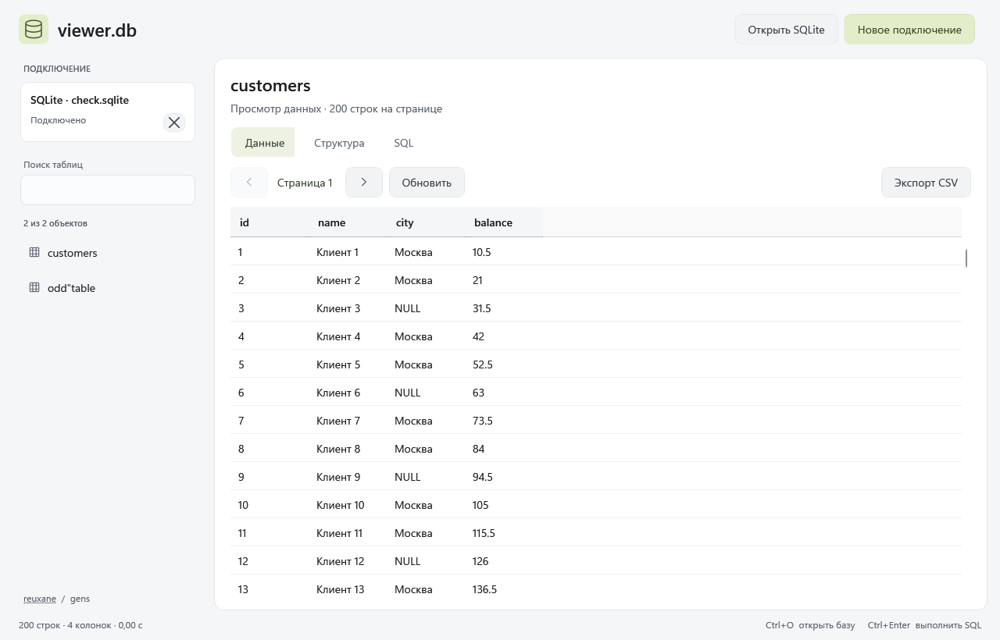

<div align="center">

# viewer.db

### Explore your databases. Run SQL. Stay focused.

A desktop database viewer for Windows with a clean, Fluent-inspired interface.


[Features](#features) · [Getting started](#getting-started) · [Building from source](#building-from-source) · [Author](#author)

</div>

---

**viewer.db** makes SQL databases easier to explore. Open a SQLite file or connect to a database server, find a table, inspect its columns, and run a query. Copy the results or export them to CSV—all from a focused desktop workspace.



## Features

| Area | Capabilities |
| :--- | :--- |
| **Connections** | SQLite, PostgreSQL, MySQL / MariaDB, SQL Server, and other SQL databases through ODBC |
| **Database objects** | Browse tables and views, search by name |
| **Data browsing** | View 200 rows per page, sort loaded rows, copy selections to the clipboard |
| **Schema inspection** | Inspect column names, data types, and nullability |
| **SQL workspace** | Execute queries, request cancellation, limit results, open and save `.sql` files |
| **Export** | Save loaded table rows or query results as CSV |
| **Interface** | Light theme, soft accents, rounded controls, and a resizable sidebar |

Connection strings and passwords are not saved to disk. SQLite files can also be opened by dragging them into the application window.

## Supported databases

| Database | Connection | Behavior |
| :--- | :--- | :--- |
| **SQLite** | Local file | Opened in read-only mode |
| **PostgreSQL** | Built-in Npgsql driver | Read-only transactions enabled for the session |
| **MySQL / MariaDB** | Built-in MySqlConnector driver | Read-only transactions enabled for the session |
| **SQL Server** | Built-in Microsoft.Data.SqlClient driver | Access is controlled by the database user's permissions |
| **ODBC** | Installed 64-bit ODBC driver | Available features depend on the database and driver |

## Getting started

### Launch the application

1. Obtain the **Windows x64** build.
2. Run **`viewer.db.exe`**.
3. Open a database file or create a server connection.

The standalone build includes the .NET runtime, so a separate .NET installation is not required. On first launch, bundled components may be extracted to a temporary directory.

> [!NOTE]
> The current application interface is in Russian. This README includes English descriptions of the relevant controls.

### Open a SQLite database

Click **Open SQLite** (`Открыть SQLite`), press **Ctrl+O**, or drag a database file into the window. Once connected, select a table from the sidebar.

### Connect to a database server

Click **New connection** (`Новое подключение`), select a database provider, and enter the server, port, database name, username, and password. Windows authentication is available for SQL Server.

For additional connection options, enable **Use a connection string** (`Использовать строку подключения`). ODBC connections require a connection string.

<details>
<summary><strong>Connection string examples</strong></summary>

**PostgreSQL**

```text
Host=localhost;Port=5432;Database=mydb;Username=reader;Password=your_password
```

**MySQL / MariaDB**

```text
Server=localhost;Port=3306;Database=mydb;User ID=reader;Password=your_password
```

**SQL Server — Windows authentication**

```text
Server=localhost;Database=mydb;Integrated Security=True;Encrypt=True
```

**ODBC**

```text
DSN=MyDatabase;UID=reader;PWD=your_password
```

Configure TLS options to match your server. SQL Server connections with encryption enabled require a trusted certificate.

</details>

## Working with SQL

Open the **SQL** tab, enter a query, and click **Run** (`Выполнить`) or press **Ctrl+Enter**.

```sql
SELECT id, name, city
FROM customers
ORDER BY id;
```

Choose a result limit of **1,000**, **5,000**, or **10,000** rows. Commands use a 30-second timeout; cancellation and timeout handling depend on the provider.

Use **Open .sql** (`Открыть .sql`) and **Save** (`Сохранить`) to work with query files.

## Keyboard shortcuts

| Shortcut | Action |
| :--- | :--- |
| `Ctrl+O` | Open a SQLite file |
| `Ctrl+Enter` | Execute a SQL query |
| `Ctrl+C` | Copy the current selection when the data grid has focus |

## CSV export

Click **Export CSV** (`Экспорт CSV`) in the data or SQL workspace. Only loaded rows are exported.

- **Encoding:** UTF-8 with BOM.
- **Delimiter:** semicolon (`;`).
- **Quoting:** fields are quoted; embedded quotation marks are escaped.
- **Spreadsheet protection:** values resembling spreadsheet formulas are prefixed with an apostrophe.
- **Special values:** `NULL` becomes an empty field; BLOB values are represented by their byte count.

## Behavior and limitations

> [!IMPORTANT]
> Use a database account with read-only permissions when browsing server databases. The SQL editor sends commands to the server. For SQL Server and ODBC, the application does not block write commands; access is determined by the account's permissions. PostgreSQL and MySQL session settings do not replace proper database permissions.

- The application supports **SQL databases**. MongoDB, Redis, and other NoSQL stores are not supported.
- ODBC previews display the first 200 rows without pagination. Schema inspection depends on driver support.
- The SQL workspace displays the first result set. Execute multiple selections separately.
- Row order is not guaranteed without `ORDER BY`. Sort by a unique key when you need reproducible results.
- Values are displayed as text. Cell editing and raw binary export are not available.

## Building from source

Requirements: **Windows** and the **.NET 10 SDK**. Run the following commands from the directory containing `ViewerDb.csproj`.

```powershell
dotnet restore ViewerDb.csproj
dotnet build ViewerDb.csproj -c Release
```

Publish a standalone Windows x64 build:

```powershell
dotnet publish ViewerDb.csproj `
  -c Release `
  -r win-x64 `
  --self-contained true `
  -p:PublishSingleFile=true `
  -p:IncludeNativeLibrariesForSelfExtract=true `
  -p:EnableCompressionInSingleFile=true `
  -o publish
```

The executable will be generated at **`publish/viewer.db.exe`**.

### Technology

**C# · .NET 10 · WPF · Fluent**

Database connectivity is provided by [Microsoft.Data.Sqlite](https://www.nuget.org/packages/Microsoft.Data.Sqlite/), [Npgsql](https://www.nuget.org/packages/Npgsql/), [MySqlConnector](https://www.nuget.org/packages/MySqlConnector/), [Microsoft.Data.SqlClient](https://www.nuget.org/packages/Microsoft.Data.SqlClient/), and [System.Data.Odbc](https://www.nuget.org/packages/System.Data.Odbc/).

## Validation

The Release build and standalone application launch have been verified. SQLite integration checks cover opening a database, listing tables, pagination, schema inspection, result limits, `NULL` values, duplicate column names, identifier quoting, write rejection, and cancellation.

Connection string construction, port validation, query results, and error presentation have also been checked. Rendered application windows have been visually reviewed.

Live PostgreSQL, MySQL, SQL Server, and ODBC connections have not yet undergone integration testing.

## Reporting issues

When reporting a problem, include your Windows version, database provider, reproduction steps, and the error message. Do not include passwords, connection strings containing secrets, or confidential data.

## Author

Developed by [**reuxane**](https://github.com/reuxane), with the assistance of the **gens** team.
